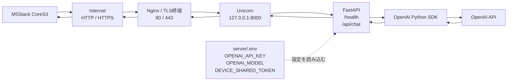

# ai-edge-server

M5Stack CoreS3などの小型デバイスからテキストを受け取り、DojoPaaS上の軽量なFastAPIサーバーを経由してOpenAI APIへ問い合わせる最小PoCです。

音声認識、音声合成、WebSocket、MQTT、データベース、ローカルLLMはまだ使用しません。

## システム構成

```text
M5Stack CoreS3
    │ HTTP/HTTPS + JSON
    ▼
DojoPaaS: FastAPI + Uvicorn
    │ OpenAI Python SDK + HTTPS
    ▼
OpenAI API
    │ JSON response
    └──────────────► DojoPaaS ──► CoreS3
```

`OPENAI_API_KEY`はDojoPaaSにだけ置き、CoreS3には保存しません。

## サーバー構成概要



DojoPaaSでは、外部からの通信をNginx（80/443）で受け、FastAPIを内部の`127.0.0.1:8000`で動かします。OpenAI APIキーは`server/.env`からサーバーだけが読み込み、CoreS3へは共有トークンだけを設定します。

## ファイル構成

```text
ai-edge-server/
├── README.md
├── .gitignore
├── server/
│   ├── main.py
│   ├── requirements.txt
│   └── .env.example
└── device/
    └── cores3/
        └── cores3.ino
```

## DojoPaaS側のセットアップ

以下はUbuntu 24.04での例です。`/opt/ai-edge-server`は実際にソースを配置する場所へ読み替えてください。

### 1. 必要なパッケージを入れる

```bash
sudo apt update
sudo apt install -y python3 python3-venv python3-pip curl
```

### 2. プロジェクトを配置して仮想環境を作る

Gitで取得する場合:

```bash
sudo mkdir -p /opt/ai-edge-server
sudo chown "$USER":"$USER" /opt/ai-edge-server
cd /opt/ai-edge-server
git clone <このリポジトリのURL> .
```

ファイルを手動で配置する場合は、プロジェクト一式を`/opt/ai-edge-server`へコピーしてから続行します。

```bash
cd /opt/ai-edge-server
python3 -m venv .venv
source .venv/bin/activate
python -m pip install --upgrade pip
python -m pip install -r server/requirements.txt
```

### 3. 環境変数を設定する

```bash
cd /opt/ai-edge-server
cp server/.env.example server/.env
nano server/.env
```

最低限、次の値を変更します。

```dotenv
OPENAI_API_KEY=実際のOpenAI APIキー
OPENAI_MODEL=gpt-4o-mini
DEVICE_SHARED_TOKEN=十分に長いランダムな共有トークン
```

共有トークンを設定すると、`POST /api/chat`は`X-Device-Token`ヘッダーが一致した場合だけ受け付けます。`GET /health`は疎通確認用に公開のままです。`DEVICE_SHARED_TOKEN`を空にすると認証なしになるため、公開サーバーでは空にしないでください。

ランダムなトークンの例:

```bash
python3 -c 'import secrets; print(secrets.token_urlsafe(32))'
```

### 4. Uvicornを起動する

まずはフォアグラウンドで動作確認します。

```bash
cd /opt/ai-edge-server
source .venv/bin/activate
uvicorn server.main:app --host 127.0.0.1 --port 8000
```

別のSSHセッションからテストします。

```bash
curl http://127.0.0.1:8000/health
```

期待されるレスポンス:

```json
{"status":"ok"}
```

### 5. systemdで常駐させる

動作確認後は、Uvicornを`127.0.0.1:8000`で常駐させます。`User=ubuntu`は実際に配置したUbuntuユーザー名へ変更してください。

```bash
sudo tee /etc/systemd/system/ai-edge-server.service >/dev/null <<'EOF'
[Unit]
Description=AI Edge Server
After=network.target

[Service]
User=ubuntu
WorkingDirectory=/opt/ai-edge-server
EnvironmentFile=/opt/ai-edge-server/server/.env
ExecStart=/opt/ai-edge-server/.venv/bin/uvicorn server.main:app --host 127.0.0.1 --port 8000
Restart=always
RestartSec=3

[Install]
WantedBy=multi-user.target
EOF
sudo systemctl daemon-reload
sudo systemctl enable --now ai-edge-server.service
sudo systemctl status ai-edge-server.service
```

### 公開URLについて

CoreS3からアクセスするには、DojoPaaSのドメインまたはIPからFastAPIへ到達できるようにします。

- 最小のHTTP確認: Uvicornを`0.0.0.0:8000`で起動し、ポート8000を公開する方法
- 推奨: NginxやCaddyを80/443で受け、内部の`127.0.0.1:8000`へリバースプロキシする方法

本番やインターネット越しではHTTPSを使用してください。TLS終端をDojoPaaSの機能やNginx/Caddyで行い、CoreS3の`SERVER_URL`を`https://...`にします。

Nginxを使う場合の最小例です。まずDNSの`your-domain.example`がDojoPaaSのIPを向いていることを確認してください。

```bash
sudo apt install -y nginx
sudo tee /etc/nginx/sites-available/ai-edge-server >/dev/null <<'EOF'
server {
    listen 80;
    server_name your-domain.example;

    location / {
        proxy_pass http://127.0.0.1:8000;
        proxy_set_header Host $host;
        proxy_set_header X-Real-IP $remote_addr;
        proxy_set_header X-Forwarded-For $proxy_add_x_forwarded_for;
        proxy_set_header X-Forwarded-Proto $scheme;
    }
}
EOF
sudo ln -s /etc/nginx/sites-available/ai-edge-server /etc/nginx/sites-enabled/ai-edge-server
sudo nginx -t
sudo systemctl reload nginx
```

HTTPSを有効にする場合は、ドメインを置き換えてからCertbotを実行します。

```bash
sudo apt install -y certbot python3-certbot-nginx
sudo certbot --nginx -d your-domain.example
```

この構成では外部公開は80/443、FastAPIは内部の`127.0.0.1:8000`だけで待ち受けます。

## curlでの確認

### `/health`

```bash
curl https://your-domain.example/health
```

### `/api/chat`

共有トークンを設定した場合:

```bash
curl https://your-domain.example/api/chat \
  -H 'Content-Type: application/json' \
  -H 'X-Device-Token: 実際の共有トークン' \
  -d '{"message":"こんにちは"}'
```

期待される形式:

```json
{"message":"こんにちは！今日は何をしましょうか？"}
```

ローカルでUvicornを直接起動している場合は、URLを`http://127.0.0.1:8000`に置き換えます。

## CoreS3側の設定

1. Arduino IDEにM5Stackのボード定義を追加し、`M5CoreS3`を選択します。
2. Arduino Library Managerから`ArduinoJson`をインストールします。
3. `device/cores3/cores3.ino`を開き、先頭の設定を変更します。

```cpp
const char* WIFI_SSID = "自宅や現場のWi-Fi SSID";
const char* WIFI_PASSWORD = "Wi-Fiパスワード";
const char* SERVER_URL = "https://your-domain.example";
const char* DEVICE_SHARED_TOKEN = "サーバーと同じ共有トークン";
```

OpenAI APIキーはCoreS3へ設定しません。

このサンプルは画面表示を省略し、Serial Monitorへ結果を出します。CoreS3へ書き込み後、Serial Monitorを`115200 baud`で開いてください。

## CoreS3からの疎通確認

起動時に次の順で実行します。

1. Wi-Fiへ接続
2. `GET /health`
3. `POST /api/chat`へ`{"message":"こんにちは"}`を送信
4. JSONの`message`をSerialへ表示

成功時のログ例:

```text
Wi-Fi connected, IP: 192.168.x.x
GET /health -> 200
{"status":"ok"}
POST /api/chat -> 200
{"message":"..."}
AI response:
...
```

`401`の場合は、CoreS3と`server/.env`の共有トークンが一致しているか確認します。`502`の場合は、DojoPaaSのログとOpenAI APIキー・モデル名を確認します。

## セキュリティ上の注意

- `server/.env`はGitへコミットしないでください。`.gitignore`で除外しています。
- OpenAI APIキーはDojoPaaSだけに置きます。
- CoreS3には共有トークンだけを置き、OpenAI APIへ直接接続しません。
- 公開サーバーでは`DEVICE_SHARED_TOKEN`を必ず設定し、可能ならHTTPSを使います。
- CoreS3サンプルのHTTPS接続はPoCのため証明書検証を省略しています。公開運用前にCA証明書または証明書ピンニングへ変更してください。

共有トークンは第三者へ知られると、その第三者がAPI利用枠を消費できるため、漏えい時はサーバーとCoreS3の両方で変更してください。

## 次に音声対応するときの変更箇所

- CoreS3: マイク入力と音声データの取得を追加し、`/api/chat`へ送る入力をテキストから音声アップロードへ変更
- サーバー: 音声受付用エンドポイントを追加し、OpenAIの音声認識APIを呼び出す処理を追加
- サーバー: 必要ならテキスト応答を音声合成APIへ渡す処理を追加
- CoreS3: 返ってきた音声データを再生

現段階の`/health`、共有トークン、OpenAIキー管理、Uvicorn構成はそのまま再利用できます。
