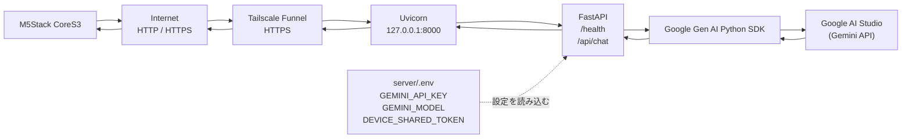

# ai-edge-server

M5Stack CoreS3などの小型デバイスからテキストを受け取り、DojoPaaS上の軽量なFastAPIサーバーを経由してGoogle AI StudioのGemini APIへ問い合わせる最小PoCです。

音声認識、音声合成、WebSocket、MQTT、データベース、ローカルLLMはまだ使用しません。

## 認証設計

採用したデバイス単位の認証方針は [ADR-0001](docs/adr/0001-device-authentication.md) に記録しています。

ただし、現行のPoC実装はまだ全デバイス共通の`DEVICE_SHARED_TOKEN`方式です。ADRの方式へ移行するまでは、公開運用ではなく検証用途に限定し、HTTPSと共有トークンを必ず使用してください。

## システム構成

```text
M5Stack CoreS3
    │ HTTP/HTTPS + JSON
    ▼
DojoPaaS: FastAPI + Uvicorn
    │ Google Gen AI Python SDK + HTTPS
    ▼
Google AI Studio (Gemini API)
    │ JSON response
    └──────────────► DojoPaaS ──► CoreS3
```

`GEMINI_API_KEY`はDojoPaaSにだけ置き、CoreS3には保存しません。

## サーバー構成概要



DojoPaaSでは、外部からの通信をTailscale Funnelで受け、FastAPIを内部の`127.0.0.1:8000`で動かします。Gemini APIキーは`server/.env`からサーバーだけが読み込み、CoreS3へは共有トークンだけを設定します。

## ファイル構成

```text
ai-edge-server/
├── README.md
├── .gitignore
├── tailscale-setup.sh
├── server/
│   ├── main.py
│   ├── requirements.txt
│   └── .env.example
└── device/
    └── cores3/
        └── cores3.ino
```

## DojoPaaS側のセットアップ

以下はUbuntu 24.04での例です。`/opt/ai-edge-server`は実際にソースを配置する場所へ読み替えてください。

### 1. 必要なパッケージを入れる

```bash
sudo apt update
sudo apt install -y git python3 python3-venv python3-pip
```

### 2. Gitでプロジェクトを取得して仮想環境を作る

```bash
sudo mkdir -p /opt/ai-edge-server
sudo chown "$USER":"$USER" /opt/ai-edge-server
cd /opt/ai-edge-server
git clone <このリポジトリのURL> .
python3 -m venv .venv
source .venv/bin/activate
python -m pip install --upgrade pip
python -m pip install -r server/requirements.txt
```

### 3. 環境変数を設定する

```bash
cd /opt/ai-edge-server
cp server/.env.example server/.env
nano server/.env
```

最低限、次の値を変更します。

```dotenv
GEMINI_API_KEY=実際のGemini APIキー
GEMINI_MODEL=gemini-3.8-flash
DEVICE_SHARED_TOKEN=十分に長いランダムな共有トークン
```

`GEMINI_API_KEY`はサーバー側の環境変数にだけ設定し、GitやCoreS3へコピーしないでください。Google AI Studio側ではGemini API専用の制限を設定し、本番ではDojoPaaSのSecret機能などを使うことを推奨します。

共有トークンを設定すると、`POST /api/chat`は`X-Device-Token`ヘッダーが一致した場合だけ受け付けます。`GET /health`は疎通確認用に公開のままです。`DEVICE_SHARED_TOKEN`を空にすると認証なしになるため、公開サーバーでは空にしないでください。

ランダムなトークンの例:

```bash
python3 -c 'import secrets; print(secrets.token_urlsafe(32))'
```

### 4. Uvicornを起動する

まずはフォアグラウンドで動作確認します。

```bash
cd /opt/ai-edge-server
source .venv/bin/activate
uvicorn server.main:app --host 127.0.0.1 --port 8000
```

別のSSHセッションからテストします。

```bash
curl http://127.0.0.1:8000/health
```

期待されるレスポンス:

```json
{"status":"ok"}
```

### 5. systemdで常駐させる

動作確認後は、Uvicornを`127.0.0.1:8000`で常駐させます。`User=ubuntu`は実際に配置したUbuntuユーザー名へ変更してください。

```bash
sudo tee /etc/systemd/system/ai-edge-server.service >/dev/null <<'EOF'
[Unit]
Description=AI Edge Server
After=network.target

[Service]
User=ubuntu
WorkingDirectory=/opt/ai-edge-server
EnvironmentFile=/opt/ai-edge-server/server/.env
ExecStart=/opt/ai-edge-server/.venv/bin/uvicorn server.main:app --host 127.0.0.1 --port 8000
Restart=always
RestartSec=3

[Install]
WantedBy=multi-user.target
EOF
sudo systemctl daemon-reload
sudo systemctl enable --now ai-edge-server.service
sudo systemctl status ai-edge-server.service
```

### Tailscaleで手動セットアップする場合

`tailscale-setup.sh`は、Ubuntu上でTailscale、Tailscale SSH、Funnelをまとめて設定する手動セットアップ用スクリプトです。Tailscaleの認証はブラウザで行います。

Funnelはローカルの`127.0.0.1:8000`をインターネットへ公開します。FastAPI側の`DEVICE_SHARED_TOKEN`を設定し、公開して問題ないサービスであることを確認してから実行してください。tailnet内の端末だけに公開したい場合は、Funnelではなく`tailscale serve`を使用してください。

#### 実行方法

Gitでプロジェクトを取得したUbuntuサーバーのプロジェクトディレクトリで実行します。

```bash
cd /opt/ai-edge-server
chmod +x tailscale-setup.sh
sudo ./tailscale-setup.sh
```

スクリプトは次の処理を行います。

1. Tailscaleをインストール（未インストールの場合）
2. `tailscaled`を起動し、OS起動時に自動起動するよう設定
3. ブラウザ認証用のURLを表示
4. Tailscale SSHを有効化
5. `127.0.0.1:8000`をFunnelで公開
6. Tailscale IP、接続状態、Funnelの公開URLを表示

認証URLが表示されたら、別のPCのブラウザでURLを開いてサーバーをtailnetへ追加します。初回のFunnel実行では、Funnelの利用許可やHTTPS証明書の発行について確認を求められることがあります。

アプリのポートを変更している場合は、次のように指定します。

```bash
sudo env FUNNEL_PORT=8080 ./tailscale-setup.sh
```

SSH接続例に表示するLinuxユーザー名を変更する場合:

```bash
sudo env SSH_USER=ubuntu ./tailscale-setup.sh
```

`tailscale set --ssh`はサーバー側でTailscale SSHを有効にするだけで、tailnetのAccess Controlsに接続許可が必要です。接続時は、スクリプトの最後に表示される例を使用します。

```bash
ssh ubuntu@<表示されたTailscale IPv4アドレス>
```

Funnelの状態確認:

```bash
sudo tailscale funnel status
sudo tailscale status
```

Funnelを停止して公開設定を解除する場合:

```bash
sudo tailscale funnel reset
```

Tailscale SSHを無効にする場合:

```bash
sudo tailscale set --ssh=false
```

このスクリプトはsystemdが有効なUbuntuを対象としています。Dockerコンテナ、systemd無効のWSL、その他の非Ubuntu環境では使用しないでください。

## curlでの確認

`tailscale-setup.sh`の最後に表示されたFunnel URLを使って確認します。以下のURLは実際のFunnel URLへ置き換えてください。

### `/health`

```bash
FUNNEL_URL="https://your-machine.your-tailnet.ts.net"
curl "$FUNNEL_URL/health"
```

### `/api/chat`

共有トークンを設定した場合:

```bash
curl "$FUNNEL_URL/api/chat" \
  -H 'Content-Type: application/json' \
  -H 'X-Device-Token: 実際の共有トークン' \
  -d '{"message":"こんにちは"}'
```

期待される形式:

```json
{"message":"こんにちは！今日は何をしましょうか？"}
```

ローカルでUvicornを直接起動している場合は、`FUNNEL_URL`を`http://127.0.0.1:8000`に置き換えます。

## CoreS3側の設定

1. Arduino IDEにM5Stackのボード定義を追加し、`M5CoreS3`を選択します。
2. Arduino Library Managerから`ArduinoJson`をインストールします。
3. `device/cores3/cores3.ino`を開き、先頭の設定を変更します。

```cpp
const char* WIFI_SSID = "自宅や現場のWi-Fi SSID";
const char* WIFI_PASSWORD = "Wi-Fiパスワード";
const char* SERVER_URL = "https://your-machine.your-tailnet.ts.net";
const char* DEVICE_SHARED_TOKEN = "サーバーと同じ共有トークン";
```

Gemini APIキーはCoreS3へ設定しません。

このサンプルは画面表示を省略し、Serial Monitorへ結果を出します。CoreS3へ書き込み後、Serial Monitorを`115200 baud`で開いてください。

## CoreS3からの疎通確認

起動時に次の順で実行します。

1. Wi-Fiへ接続
2. `GET /health`
3. `POST /api/chat`へ`{"message":"こんにちは"}`を送信
4. JSONの`message`をSerialへ表示

成功時のログ例:

```text
Wi-Fi connected, IP: 192.168.x.x
GET /health -> 200
{"status":"ok"}
POST /api/chat -> 200
{"message":"..."}
AI response:
...
```

`401`の場合は、CoreS3と`server/.env`の共有トークンが一致しているか確認します。`502`の場合は、DojoPaaSのログとGemini APIキー・モデル名を確認します。

## セキュリティ上の注意

- `server/.env`はGitへコミットしないでください。`.gitignore`で除外しています。
- Gemini APIキーはDojoPaaSだけに置きます。
- CoreS3には共有トークンだけを置き、Gemini APIへ直接接続しません。
- Tailscale Funnelはインターネットへ公開されるため、`DEVICE_SHARED_TOKEN`を必ず設定します。
- Gemini APIキーはGemini API専用に制限し、開発用と本番用で分けます。
- CoreS3サンプルのHTTPS接続はPoCのため証明書検証を省略しています。公開運用前にCA証明書または証明書ピンニングへ変更してください。

共有トークンは第三者へ知られると、その第三者がAPI利用枠を消費できるため、漏えい時はサーバーとCoreS3の両方で変更してください。

## 次に音声対応するときの変更箇所

- CoreS3: マイク入力と音声データの取得を追加し、`/api/chat`へ送る入力をテキストから音声アップロードへ変更
- サーバー: 音声受付用エンドポイントを追加し、Gemini APIの音声対応機能を呼び出す処理を追加
- サーバー: 必要ならGemini APIまたは別の音声合成APIへ応答を渡す処理を追加
- CoreS3: 返ってきた音声データを再生

現段階の`/health`、共有トークン、Gemini APIキー管理、Uvicorn構成はそのまま再利用できます。
